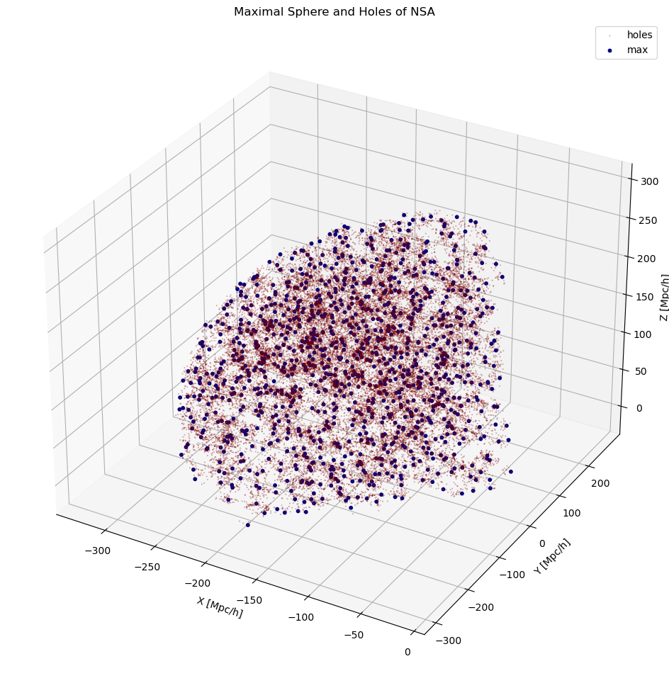
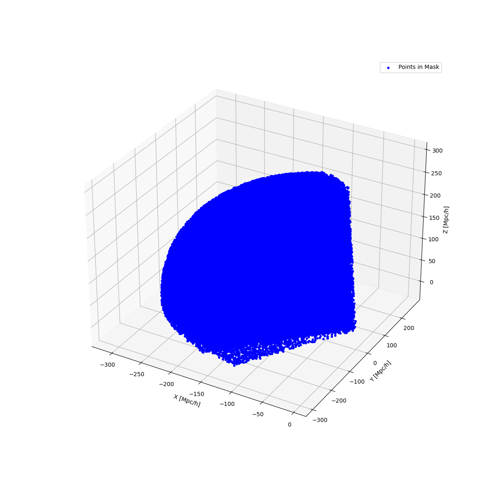
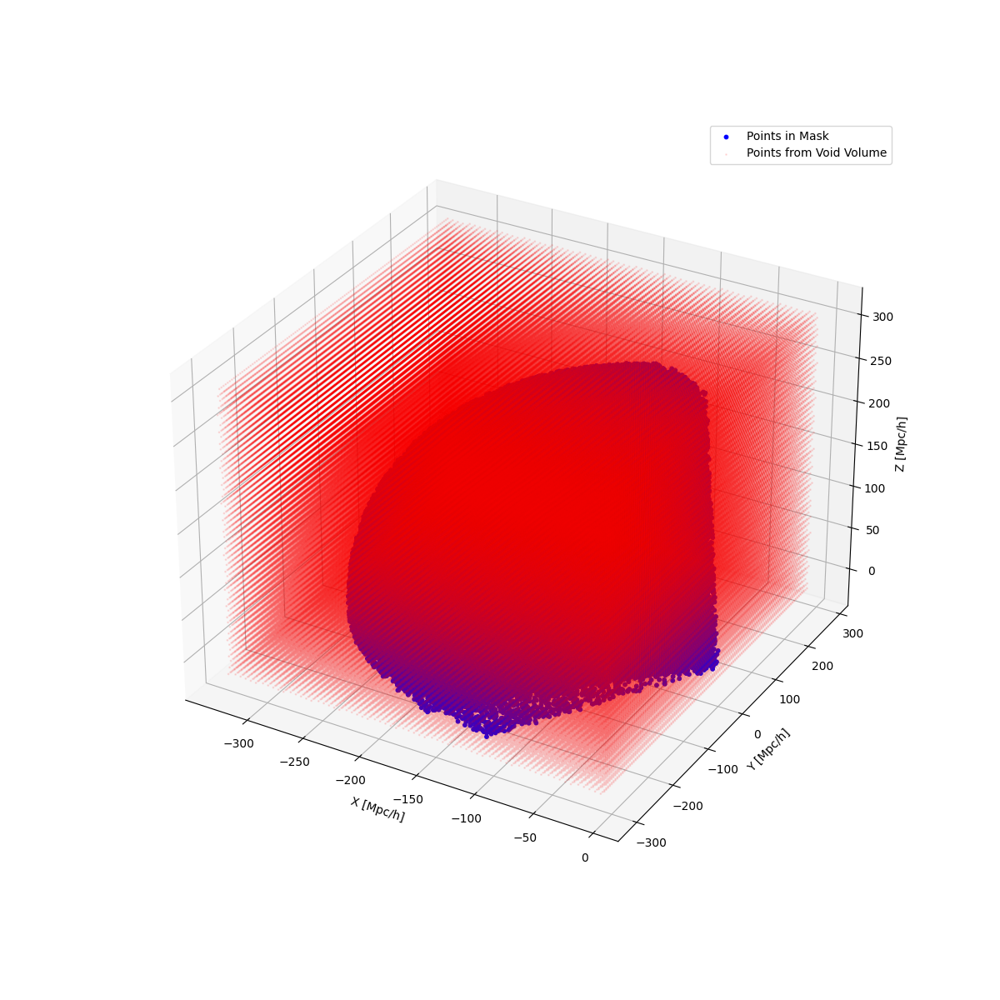

# CatalogComparer

*Required, __Important__:* Please read the documentation and is install [VAST](https://vast.readthedocs.io/en/latest/index.html) before using this software as this tool is to compare catalogs produced from the VAST.

## Contents
* [Setup](#setup)
* [I/O](#io)
* [Run](#run)
* [Options](#options)
    * [Save](#save)
    * [Plot](#Plot)


## Setup
CatalogComparer is written purely in Python 3. Please make sure to have it installed in your system before proceeding with the rest of these instructions. This readme assumes that the `python` keyword has been aliased to `python3`. This readme contains code that's meant for Unix-based terminals (Mac, Linux...). Windows analogues may be *slightly* different. 

Clone this repository by running the following in the terminal:
```
git clone https://github.com/lorenzom222/CompareCatalogs.git
```

*Optional, __recommended__:* Create and activate a virtual environment to host CatalogComparer by running the following from the terminal while inside the centerfinder directory:
```
python -m venv cc_env
source cc_env/bin/activate
```

You can choose any package manager for python to install CatalogComparer's requirements in the virtual environment (or directly to your system, if you didn't follow the *optional recommendation* above). I have chosen pip here as an example:
```
pip install -r requirements.txt
```

If you are running CenterFinder in a virtual environment, don't forget to deactivate the environment once the job has finished:
```
deactivate
```


## I/O
The CatalogComparer tool is a program that compares galaxy catalogs from different sources and calculates the void and galaxy statistics for each catalog. It can also compare the results obtained using different void finders algorithms, and plots the results for comparison. The inputs and outputs of the tool are described below.

Inputs:

- 'mask_file_name': A pickle file containing a boolean mask. Required.
- 'rmin': The minimum radius of the spheres to be used for void finding. Required.
- 'rmax': The maximum radius of the spheres to be used for void finding. Required.
- 'compare': An integer that specifies the algorithm comparison option. 0 for VF vs VF, 1 for V2 vs V2, or 2 for VF vs V2. Required.
- 'omega': A float representing the density parameter Omega. Optional.
- 'h': A float representing the Hubble constant. Optional.
- 'data_files': A list of paths to the input data files. Required.
- 'show_plots': A flag to show plots created with matplotlib. Optional.
- 's': A flag to save the results obtained. Optional.

Outputs:

- Void and galaxy statistics for each catalog.
- Plots showing the results of the comparison between the catalogs


## Run
The following portion contains commands for running CatalogComparer under different contexts.

#### Voidfinder Comparisons
The Voidfinder Comparisons procedure allows for the comparison of two Voidfinder catalogs. This can be useful when comparing Voidfinder catalogs from different surveys or when comparing Voidfinder catalogs generated using different Voidfinder algorithms. To use this procedure, you simply need to call the following command
```
python compare_catalogs.py --mask_file_name mask.pickle --rmin 0 --rmax 312.89816 --compare 0 --data_files VF_comoving_holes.txt V
F_comoving_maximal.txt VF_comoving_holes.txt VF_comoving_maximal.txt 
```

#### V^2 Comparisons
The V^2 Comparisons procedure allows for the comparison of two V^2 catalogs. This can be useful when comparing V^2 catalogs from different surveys or when comparing V^2 catalogs generated using different Voidfinder algorithms. To use this procedure, you need to call the following command:
```
python compare_catalogs.py --mask_file_name mask.pickle --rmin 0 --rmax 312.89816 --compare 1 --omega 0.3089 --h 1.0 --data_files 
V2_galzones.dat V2_REVOLVER_zonevoids.dat V2_REVOLVER_zonevoids.dat V2_gal.txt V2_galzones.dat V2_gal.txt 
```
#### Voidfinder Comparison to V^2 Performance
The Voidfinder Comparison to V^2 Performance procedure allows for the comparison of a Voidfinder catalog and a V^2 catalog. This can be useful when comparing the performance of Voidfinder and V^2 algorithms or when comparing catalogs generated using different parameters. To use this procedure, you need to call the following command:

```
python compare_catalogs.py --mask_file_name mask.pickle --rmin 0 --rmax 312.89816 --compare 2 --omega 0.3089 --h 1.0 --data_files VF_comoving_holes.txt VF_comoving_maximal.txt V2_galzones.dat V2_REVOLVER_zonevoids.dat V2_gal.txt 
```


## Options
The following portion contains optional arguments that may be needed or wanted when running CenterFinder.

#### Plot
Add the following argument to have CatalogComparer create and show a plot of the mask file along with the Volume boundary applied.
```
--show_plots True
```


#### Save
Add the --s argument to save additional outputs.
```
python compare_catalogs.py --mask_file_name mask.pickle --rmin 0 --rmax 312.89816 --compare 0 --data_files VF_comoving_holes.txt V
F_comoving_maximal.txt VF_comoving_holes.txt VF_comoving_maximal.txt --show_plots True --s True
```








